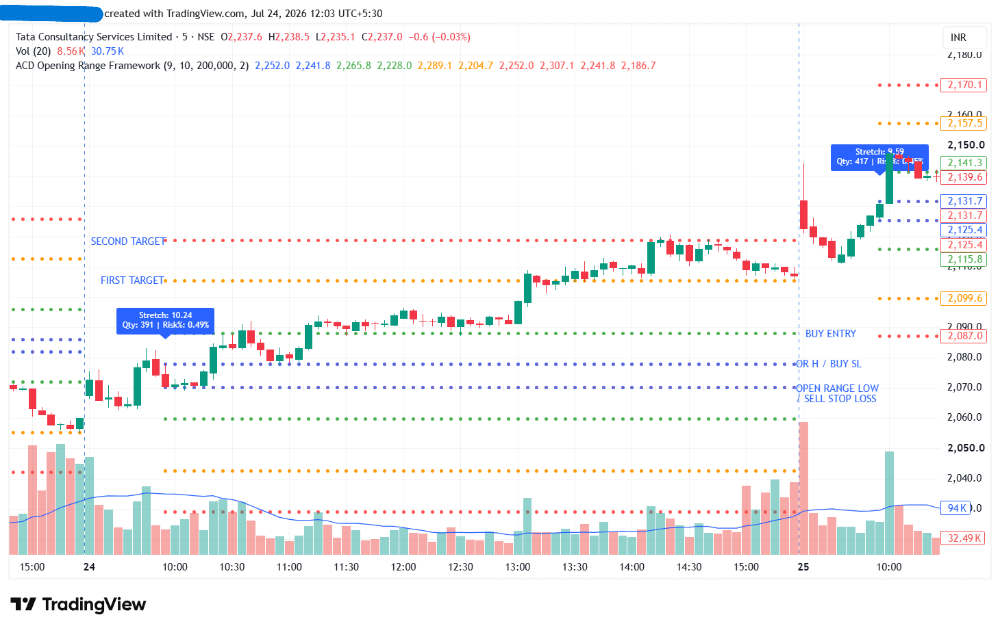
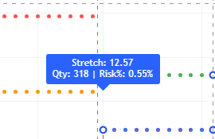
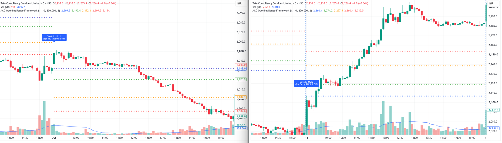
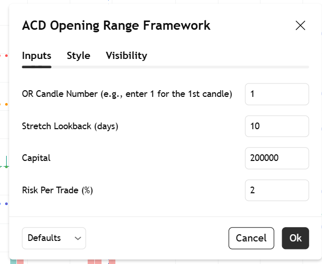

# ACD Opening Range Framework

A TradingView Pine Script indicator for intraday opening-range analysis using single-candle OR logic, stretch-based A/C levels, projected targets, and risk-based position sizing.

## Overview

ACD Opening Range Framework is designed to help traders structure the early session using a configurable single-candle opening range and stretch-based reference levels. The script combines opening-range logic, directional breakout levels, target projection, and quantity estimation into a single chart-based workflow.

The indicator is inspired by Mark Fisher's ACD framework and Toby Crabel's opening-range concepts. It is intended for educational and analytical use and should not be treated as financial advice.

## Features

- Configurable single-candle Opening Range (OR).
- Daily stretch calculation using a user-defined lookback period.
- A-up and A-down reference levels derived from OR and stretch.
- Projected directional targets for both long and short scenarios.
- Risk-based quantity calculation using user-defined capital and risk per trade.
- On-chart label output for stretch value, quantity, and risk percentage.
- Intraday visualization of key levels directly on the TradingView chart.

## Screenshots

### Chart Overview
Displays the full indicator layout, including the opening range, A-levels, projected targets, and stop reference levels.

### Label Output
Displays the on-chart label with stretch value, calculated quantity, and risk percentage for the session setup.

### Range Setup Example
Displays an example of how the framework structures a live intraday setup using the selected opening-range candle.

### Settings Tool Box
Displays the indicator settings panel, including inputs for OR candle number, stretch lookback, capital, and risk per trade.

## How It Works

The script follows a structured intraday process:

1. Pulls daily context for stretch calculation using a historical lookback.
2. Detects the start of a new trading day and resets all opening-range variables.
3. Captures the high and low of a user-selected intraday candle as the Opening Range.
4. Computes stretch-based A-up and A-down breakout reference levels.
5. Projects directional targets and corresponding stop reference levels.
6. Estimates quantity from capital, user-defined risk percentage, and per-share risk.
7. Prints the final setup details on the chart once the selected OR candle is complete.

## Technical Approach

- Algorithmic trading logic.
- Time-series calculations.
- Intraday range analysis.
- Risk-based position sizing.
- Real-time chart visualization in TradingView.

## Inputs

The indicator includes the following configurable settings:

- **OR Candle Number** — selects which intraday candle defines the opening range.
- **Stretch Lookback** — controls the number of days used in the stretch calculation.
- **Capital** — sets the notional capital used for quantity estimation.
- **Risk Per Trade (%)** — lets the user define the percentage of capital to risk on each setup.

## Usage

1. Open TradingView.
2. Open Pine Editor.
3. Copy the script from `acd-opening-range-framework.pine`.
4. Paste it into Pine Editor.
5. Save the script and add it to the chart.
6. Adjust the OR candle number, capital, stretch lookback, and risk percentage from the settings panel.

## Notes

This project is intended for educational and analytical purposes. It does not provide trading advice, guaranteed entries, or assured outcomes in live markets.

## License

This project is licensed under the MIT License.
